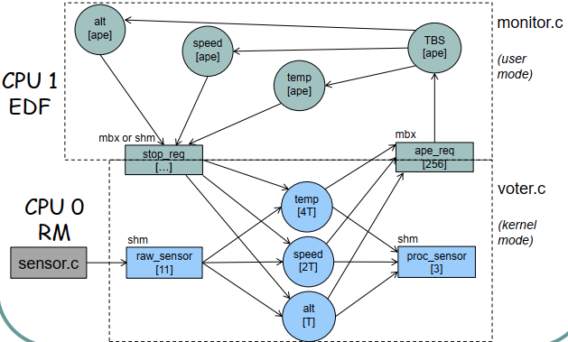

# Projects

## Database Fundamentals

 **Programming Languages** : SQL
 **Description** : Analysis of the COVID trend during the first months of 2020.

## Software Engineering

 **Programming Languages** : Java | UML | Junit
 **Description** : Implementation of the control logic for a financial brokerage company.

## Fundamentals of Artificial Intelligence

 **Programming Languages** : Python
 **Description** : Application of the DT Learning to the 'mushroom' dataset to determine the toxicity of a fungus, decision tree theory. Greedy algorithm to optimize the organization of a trip for a group of people belonging to the same family (hill climbing and genetic algorithm).

## Fundamentals of Dynamic Systems

 **Programming Languages** : Matlab | Simulink
 **Description** : Exercises related to systems applied to: RLC, DEBT DAMPING, ANTI-THEFT BELT, PHARMACOLOGY, PHASOR...

## Real-Time Systems Design and Development

 **Programming Languages** : C
 **Description** : Exercise on managing shared resources with hard real-time aperiodic tasks using a monitor, sending messages from different sources, and waking up aperiodic tasks.

